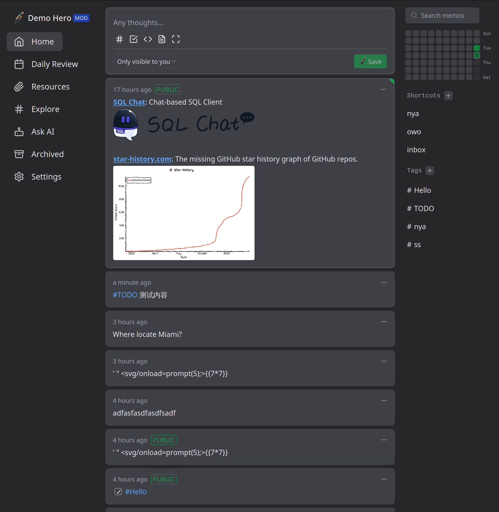

# {{ $frontmatter.title }}

{{ $frontmatter.date }} • {{ $frontmatter.tags }}

{{ $frontmatter.description }}

## Prerequisite

You need a running Kubernetes cluster to follow this post, if you don't have one available at the moment
I suggest you have a look at [kind](https://kind.sigs.k8s.io/).


## Memos

Structured note-taking is a pretty tough task on its own, there are a lot of open-source projects,
that try to solve this in different ways. You can find an up-to-date list of available projects
on [GitHub](https://github.com/awesome-selfhosted/awesome-selfhosted#note-taking--editors).

[Memos](https://github.com/usememos/memos) itself is only a server and a web app, that will store
your notes, that are based on [Markdown](https://www.markdownguide.org/), within a SQLite database.



Despite providing a web application out of the box, there is also a project called [Moe Memos](https://memos.moe/), 
that provides clients for [Android](https://f-droid.org/packages/me.mudkip.moememos/) and [iOS](https://apps.apple.com/app/moe-memos/id1643902185).

::: tip
There is a memos [demo](https://demo.usememos.com/) available online!
:::

### Kubernetes

In order to deploy memos, we need several Kubernetes resources:

```shell
.
├── deployment.yaml
├── kustomization.yaml
├── namespace.yaml
├── pvc.yaml
└── service.yaml
```

#### kustomization.yaml
Let's start by creating a `kustomization.yaml`, that will be used to bundle all other resources:

::: code-group
<<< @/blog/memos/code/kustomization.yaml
:::

#### namespace.yaml
The most obvious resource is the `namespace`, so let's create it:

::: code-group
<<< @/blog/memos/code/namespace.yaml
:::

#### pvc.yaml
After creating the namespace, we will create a `PersistentVolumeClaim`, that is used to persist our data:

::: code-group
<<< @/blog/memos/code/pvc.yaml
:::

::: tip
If you don't have a custom storage class available within your cluster, you can also use a volume of 
type `hostPath`:
:::

::: code-group
<<< @/blog/memos/code/pvc-hostpath.yaml
:::

#### deployment.yaml
As we have defined a persistent volume for our memos server, we can continue to deploy memos itself:

::: code-group
<<< @/blog/memos/code/deployment.yaml
:::

::: tip
This post might be outdated pretty soon, you might want to check the official
[Docker repository](https://hub.docker.com/r/neosmemo/memos/tags) of memos to see if there is a new version available
:::

#### service.yaml
As you might want to expose the deployment by using a custom ingress controller, we also create a
`service`.

::: code-group
<<< @/blog/memos/code/service.yaml
:::

## Access

After exposing the service to your local network, you can connect to memos by using the browser or 
the available [clients](#memos) mentioned previously.

::: tip
A restart/redeployment of the server will cause all clients to lose their connection. This is a known 
[issue](https://github.com/mudkipme/MoeMemosAndroid/issues/1) and can be solved, by using the OpenAPI
login within the mobile applications.
:::

## Verdict

Memos is a very simple note-taking application, that is pretty simple, but also powerful and can be 
easily deployed within a homelab.